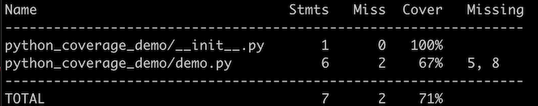

<a name="readme-top"></a>

Pytest Coverage Demo Project
============================

> Code coverage demo

This project demonstrates how to setup a Python project using Poetry to get
a report on code coverage.

<details open>
  <summary>Table of Contents</summary>

* [✨&nbsp;Quick start](#quick-start)
* [:notebook: Manifest](#notebook-manifest)
* [🤖&nbsp;Usage](#usage)
   * [1. Running tests](#1-running-tests)
   * [2. View coverage report](#2-view-coverage-report)
* [🚀 Setup](#setup)
  * [Dependencies](#dependencies)
  * [1. Install Poetry](#1-install-poetry)
  * [2. Create project](#2-create-project)
  * [3. Install test packages](#3-install-test-packages)
  * [4. Configure coverage](#4-configure-coverage)
  * [5. Update .gitignore](#5-update-gitignore)
* [💡 See also](#see-also)
* [:clipboard: Meta](#clipboard-meta)

</details>

<br />

## ✨&nbsp;Quick start

Install packages and start a `poetry` shell.

```bash
poetry add --dev pytest coverage
poetry shell
```

Then generate and view the coverage report.

```bash
coverage run -m pytest && coverage report -m
```



<p align="right">(<a href="#user-content-readme-top">back to top</a>)</p>

:notebook: Manifest
-------------------

This project was generated using the `poetry new` command and has this
directory structure.

```text
├── .coverage
├── .gitignore
├── README.md
├── poetry.lock
├── pyproject.toml
├── python_coverage_demo
│   ├── __init__.py
│   └── demo.py
└── tests
    ├── __init__.py
    └── test_python_coverage_demo.py
```

Here are more detailed descriptions of the relavant files.

| Filename                             | Contains                                                     |
|--------------------------------------|--------------------------------------------------------------|
| `.coverage`                          | generated results of the `coverage run` command              |
| `.gitignore`                         | list of files and directories to exclude from source control |
| `pyproject.toml`                     | project dependencies and `coverage` settings                 |
| `python_coverage_demo/__init__.py`   | version                                                      |
| `python_coverage_demo/demo.py`       | demo python functions                                        |
| `tests/test_python_coverage_demo.py` | tests for some, but not all, demo functions                  |

<p align="right">(<a href="#user-content-readme-top">back to top</a>)</p>

🤖&nbsp;Usage
--------------

### 1. Running tests

First you'll need to run your tests using the `coverage` program.

```bash
coverage run -m pytest
```

Alternatively if you set up the configurations in your `pyproject.py` per the
[instructions](#4-configure-coverage) below you can simply type:

```bash
coverage run
```

This will run your tests via `pytest` as usual and will additionally generate
a `.coverage` file.

```
========================= test session starts ==========================
platform darwin -- Python 3.9.1, pytest-5.4.3, py-1.11.0, pluggy-0.13.1
rootdir: ~/demo/python_coverage_demo
plugins: pylama-8.4.1
collected 3 items

tests/test_python_coverage_demo.py ...                            [100%]

========================== 3 passed in 0.01s ===========================
```

<p align="right">(<a href="#user-content-readme-top">back to top</a>)</p>

### 2. View coverage report

To view the coverage report replace `python_coverage_demo` with the path(s) to
your code in the following command:

```bash
coverage report -m --include='python_coverage_demo/*.py'
```

Alternatively if you set up the configurations in your `pyproject.py` per the
[instructions](#4-configure-coverage) below you can simply type:

```bash
coverage report
```

Ta da!

```
Name                               Stmts   Miss  Cover   Missing
----------------------------------------------------------------
python_coverage_demo/__init__.py       1      0   100%
python_coverage_demo/demo.py           6      2    67%   5, 8
----------------------------------------------------------------
TOTAL                                  7      2    71%
```

<p align="right">(<a href="#user-content-readme-top">back to top</a>)</p>

🚀&nbsp;Setup
--------------

### Dependencies

This project makes use of the following tools:

| Tool            | Purpose                   |
|-----------------|---------------------------|
| [Poetry][]      | dependency management     |
| [Pytest][]      | test runner               |
| [Coverage.py][] | code coverage measurement |

<p align="right">(<a href="#user-content-readme-top">back to top</a>)</p>

### 1. Install Poetry

Install [Poetry][install-poetry] according to its docs.

[install-poetry]: https://python-poetry.org/docs/#installation

<p align="right">(<a href="#user-content-readme-top">back to top</a>)</p>

### 2. Create project

Use an existing Poetry project or create one using the `poetry new` command.

```bash
poetry new my-project
```

<p align="right">(<a href="#user-content-readme-top">back to top</a>)</p>

### 3. Install test packages

Install the `pytest` and `coverage` packages:

```bash
poetry add --dev pytest coverage
```

Then start a poetry shell.

```bash
poetry shell
```

<p align="right">(<a href="#user-content-readme-top">back to top</a>)</p>

### 4. Configure `coverage`

Add the following to your `pyprpoject.toml` replacing `python_coverage_demo` with the
name of the directory containing your code.

> `pyproject.toml`

```toml
[tool.coverage.run]
command_line = "-m pytest"

[tool.coverage.report]
include = ["python_coverage_demo/*.py"]
show_missing = true
```

<p align="right">(<a href="#user-content-readme-top">back to top</a>)</p>

### 5. Update `.gitignore`

Add `.coverage` to your `.gitignore` file.

> `.gitignore`

```text
__pycache__
.pytest_cache
.coverage
```

<p align="right">(<a href="#user-content-readme-top">back to top</a>)</p>

💡&nbsp;See also
-----------------

* [Test Coverage with Pytest][]
* [Coverage.py Docs][Coverage.py]

[Test Coverage with Pytest]: https://failedtofunction.com/test-coverage-with-pytest/
[Poetry]: https://python-poetry.org/
[Pytest]: https://docs.pytest.org/
[Coverage.py]: https://coverage.readthedocs.io/en/6.4.3/

<p align="right">(<a href="#user-content-readme-top">back to top</a>)</p>

:clipboard: Meta
----------------

The [python-coverage-demo][] project is distributed under the [MIT](LICENSE.txt) license.

[python-coverage-demo]: https://github.com/alissa-huskey/python-coverage-demo

